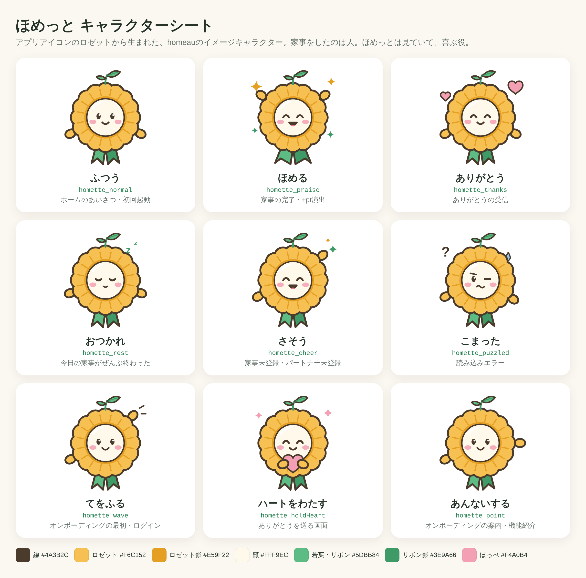

# ほめっと 素材

homeauのイメージキャラクター「ほめっと」の清書素材。方針は [ADR-0041](../../../adr/0041-homette-character-and-design-renewal.md) を参照。



| ディレクトリ | 中身 | 用途 |
|---|---|---|
| `svg/` | 表情・ポーズ9種のSVG（240×256） | 編集・Web |
| `heic/` | 同じ9種の@2x / @3x HEIC（透過。1倍で240×256pt） | `Image.xcassets`に入れる（Preserve Vector Data無効、Individual Scales） |

素材は`generate_homette.py`から生成している。形や色を直すときはこのスクリプトを編集して `python3 generate_homette.py` を流し、HEICは書き出し直す。手でSVGを直すと次の生成で消える。

HEICの書き出し手順:

1. SVGをChromiumで開き、3倍（720×768）の透過PNGとしてスクリーンショットを撮る
2. `sips`で@3xのHEICにする。@2xは3倍のPNGを縮小してから同じく変換する

   ```bash
   sips -s format heic homette_normal@3x.png --out heic/homette_normal@3x.heic
   sips -Z 512 homette_normal@3x.png --out homette_normal@2x.png
   sips -s format heic homette_normal@2x.png --out heic/homette_normal@2x.heic
   ```

### アプリに入れる形式

ベクター（SVG・PDF）ではなくHEICを@2x / @3xで入れる。

- ほめっとは画面ごとに決まった大きさで表示し、拡大しない。ベクターの利点が活きない
- ベクターで入れても、ビルド時に1x〜3xのビットマップが生成されてAssets.carに入る。複雑なイラストほど元ファイルよりずっと大きくなる
- HEICはApp Thinning後のサイズがもっとも小さい
- 配信先はiPhone・iPad（macOSなし）なので、1xは要らない
- Compressionは既定（Inherited）のままにする

根拠は「今どきの画像アセット入稿：たった1枚の画像でアプリサイズが50MB増えた失敗から学ぶ最適化方法」（上ちょ, iOSDC Japan 2026 パンフレット）。

## 色

| 部位 | 色 |
|---|---|
| 線 | `#4A3B2C` |
| ロゼット / 影 | `#F6C152` / `#E59F22` |
| 顔 | `#FFF9EC` |
| 若葉・リボン / 影 | `#5DBB84` / `#3E9A66` |
| ほっぺ | `#F4A0B4` |

ライト・ダークどちらのテーマでも同じ色で使う。
