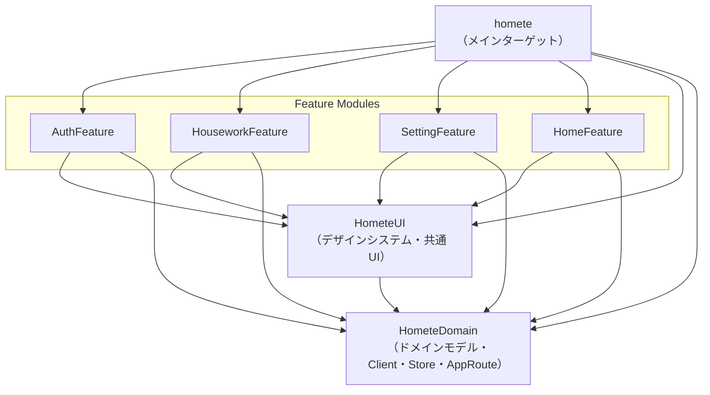

# マルチモジュール構成

> この構成を採用した背景・目的・意思決定の経緯は [ADR-0001](adr/0001-spm-multimodule-structure.md) を参照。

## モジュール構成

### 各モジュールの役割

| モジュール | 役割 | 依存先 |
|---|---|---|
| `HometeDomain` | ドメインモデル・Client プロトコル・Store・AppRoute | なし（最下層） |
| `HometeUI` | デザインシステム・共通コンポーネント・View ユーティリティ | `HometeDomain` |
| `AuthFeature` | 認証関連 View | `HometeDomain`, `HometeUI` |
| `HouseworkFeature` | 家事ボード関連 View | `HometeDomain`, `HometeUI` |
| `SettingFeature` | 設定関連 View | `HometeDomain`, `HometeUI` |
| `HomeFeature` | ホーム画面・同居人管理関連 View | `HometeDomain`, `HometeUI` |
| `homete`（メインターゲット） | Client liveValue 実装・Services・RouteResolver 実態・RootView | 全モジュール |

### ディレクトリ構成

```
HometeDomain/
  ├── Domain Models (Account, HouseworkItem, CohabitantData...)
  ├── Client Protocols + previewValue
  ├── Stores (AccountStore, HouseworkListStore, CohabitantStore, AccountAuthStore)
  └── AppRoute + RouteResolver

HometeUI/
  ├── DesignSystem（色、フォント、共通スタイル）
  ├── 共通コンポーネント（ボタン、カード等）
  └── ViewUtilities（Alert、Navigation 等）

AuthFeature/
HouseworkFeature/
SettingFeature/
HomeFeature/          ← 同居人管理 View を含む

homete（メインターゲット）/
  ├── Client liveValue 実装
  ├── Services（FirestoreService, SignInWithAppleService...）
  ├── RouteResolver 実態
  ├── RootView / AppTabView / DependenciesInjectLayer
  └── Store の初期化・Environment 注入
```

## モジュール間の依存関係



> **ルール:** Feature モジュール間の直接依存は禁止。Feature 間の画面遷移は必ず RouteResolver パターンを使用する。

## Feature 間の画面遷移（RouteResolver パターン）

Feature モジュール間で直接依存せずに画面遷移を実現するため、`HometeDomain` に `AppRoute` enum と `RouteResolver` を定義し、メインターゲットで実態を DI する。

### HometeDomain 側

```swift
// HometeDomain 側
enum AppRoute: Hashable {
    case houseworkDetail(HouseworkItem)
    case houseworkApproval(HouseworkItem)
    case registerHousework(CohabitantData)
    case cohabitantRegistration
    case setting
}

struct RouteResolver {
    var resolve: @MainActor (AppRoute) -> AnyView
}

extension EnvironmentValues {
    @Entry var routeResolver: RouteResolver = .preview
}

// Preview 用
extension RouteResolver {
    static let preview = RouteResolver { route in
        AnyView(Text("Preview: \(String(describing: route))"))
    }
}
```

### Feature 側（使用例）

```swift
// Feature 側（例: HomeFeature）
struct HomeView: View {
    @Environment(\.routeResolver) private var router

    var body: some View {
        // ...
        .sheet(isPresented: $isShowSetting) {
            router.resolve(.setting)
        }
    }
}
```

### メインターゲット側（解決実態）

```swift
// メインターゲット側
let resolver = RouteResolver { route in
    switch route {
    case .houseworkDetail(let item):
        AnyView(HouseworkDetailView(item: item))
    case .setting:
        AnyView(SettingView())
    // ...
    }
}

RootView()
    .environment(\.routeResolver, resolver)
```

## Store の配置方針

Store は `HometeDomain` に配置する。理由:

- Store は特定の画面に依存しない、全画面で再利用可能なビジネスルール・ドメインモデルを提供するオブジェクト
- 複数 Feature から共有される（例: `HouseworkListStore` は `HouseworkBoardView`、`HomeView` 等で利用）
- Client Protocol に依存するが、これも `HometeDomain` 内にあるため整合性が取れる
- メインターゲットで Store を初期化し、Environment 経由で各 Feature に注入

## 実装フェーズ

| Phase | 内容 | 状態 |
|---|---|---|
| Phase 1 | HometeDomain パッケージの切り出し（Domain Models・Client Protocols・Stores・AppRoute） | 完了 |
| Phase 2 | HometeUI パッケージの切り出し（デザインシステム・共通コンポーネント） | 未着手 |
| Phase 3 | Feature パッケージの切り出し（AuthFeature・HouseworkFeature・SettingFeature・HomeFeature） | 未着手 |
| Phase 4 | メインターゲットの整理（Services・liveValue 実装・RouteResolver 実態・RootView） | 未着手 |
| Phase 5 | テストターゲットの整理（モジュールごとのテストターゲット追加 or 既存の `hometeTests/` を更新） | 未着手 |
| Phase 6 | CI ビルド時間・テスト実行時間の計測・比較 | 未着手 |

> **推奨:** 段階的移行（Phase 1 から順に PR を分けてマージ）。1 PR での全移行はリスクが高い。

## 補足・制約事項

- **ProjectTools**（SwiftLint / Danger）は現行のローカルパッケージ形式のまま変更不要
- **Firebase iOS SDK** 等のサードパーティ依存はメインターゲット（Services 層）が保持する
- **Swift 6 strict concurrency** との整合性（actor 分離、Sendable 等）は各 Phase で確認する
- **Feature 間の循環依存**を防ぐため、Feature 間の画面遷移は必ず RouteResolver パターンを使用する
