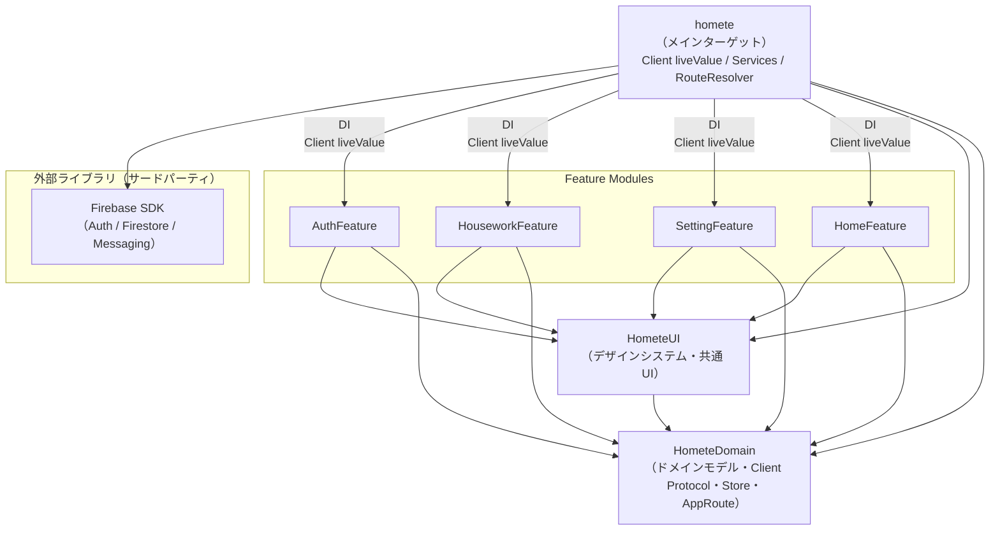

# マルチモジュール構成

> この構成を採用した背景・目的・意思決定の経緯は [ADR-0001](adr/0001-spm-multimodule-structure.md) を参照。

## モジュール構成

### 各モジュールの役割

| モジュール | 役割 | 依存先 |
|---|---|---|
| `HometeDomain` | ドメインモデル・Client プロトコル・Store・AppRoute | なし（最下層） |
| `HometeUI` | デザインシステム・共通コンポーネント・View ユーティリティ | `HometeDomain` |
| `AuthFeature` | 認証関連 View | `HometeDomain`, `HometeUI` |
| `HouseworkFeature` | 家事ボード関連 View | `HometeDomain`, `HometeUI` |
| `SettingFeature` | 設定関連 View | `HometeDomain`, `HometeUI` |
| `HomeFeature` | ホーム画面・同居人管理関連 View | `HometeDomain`, `HometeUI` |
| `homete`（メインターゲット） | Client liveValue 実装・Services・RouteResolver 実態・RootView | 全モジュール |

### ディレクトリ構成

```
HometeDomain/
  ├── Domain Models (Account, HouseworkItem, CohabitantData...)
  ├── Client Protocols + previewValue
  ├── Stores (AccountStore, HouseworkListStore, CohabitantStore, AccountAuthStore)
  └── AppRoute + RouteResolver

HometeUI/
  ├── DesignSystem（色、フォント、共通スタイル）
  ├── 共通コンポーネント（ボタン、カード等）
  └── ViewUtilities（Alert、Navigation 等）

AuthFeature/
HouseworkFeature/
SettingFeature/
HomeFeature/          ← 同居人管理 View を含む

homete（メインターゲット）/
  ├── Client liveValue 実装
  ├── Services（FirestoreService, SignInWithAppleService...）
  ├── RouteResolver 実態
  ├── RootView / AppTabView / DependenciesInjectLayer
  └── Store の初期化・Environment 注入
```

## モジュール間の依存関係



> **ルール:**
> - 外部ライブラリへの依存はメインターゲットのみが持つ。Feature モジュールは外部ライブラリに直接依存しない
> - メインターゲットは Client の `liveValue` を実装し、Environment 経由で各 Feature に DI する
> - Feature モジュール間の直接依存は禁止。Feature 間の画面遷移は必ず RouteResolver パターンを使用する
> - Feature 内部の画面遷移は RouteResolver を使用しない。Feature 専用のルート enum を定義して管理する

## Feature 間の画面遷移（RouteResolver パターン）

Feature モジュール間で直接依存せずに画面遷移を実現するため、`HometeDomain` に `AppRoute` enum を、`HometeUI` に `RouteResolver` を定義し、メインターゲットで実態を DI する。

### 使用する場面・しない場面

| 遷移の種類 | 方法 | 例 |
|---|---|---|
| **Feature 間**（別モジュールへの遷移） | `RouteResolver` + `AppRoute` を使用 | `HomeFeature` → `SettingFeature` |
| **Feature 内**（同一モジュール内の遷移） | Feature 専用のルート enum を定義 | `HouseworkFeature` 内の詳細画面遷移 |

`AppRoute` は Feature 間遷移のみを定義する。Feature 内部の画面を `AppRoute` に追加してはいけない。Feature 内の NavigationStack の遷移管理は、各 Feature が独自のルート enum（例: `HouseworkBoardRoute`）と `AppNavigationPath<RouteType>` を使って行う。

### HometeDomain 側（Feature 間ルートのみ）

```swift
// Feature 間遷移のみを定義する
enum AppRoute: Hashable {
    case cohabitantRegistration  // HomeFeature → AuthFeature
    case setting                 // HomeFeature → SettingFeature
}
```

```swift
// HometeUI 側
struct RouteResolver: Sendable {
    private var _resolve: @MainActor @Sendable (AppRoute) -> AnyView

    public init<V: View>(@ViewBuilder resolve: @escaping @MainActor @Sendable (AppRoute) -> V) {
        _resolve = { AnyView(resolve($0)) }
    }

    @MainActor
    public func resolve(_ route: AppRoute) -> some View {
        _resolve(route)
    }
}

extension EnvironmentValues {
    @Entry var routeResolver: RouteResolver = .preview
}
```

### Feature 側（使用例）

```swift
// Feature 間遷移には RouteResolver を使用する
struct HomeView: View {
    @Environment(\.routeResolver) private var router

    var body: some View {
        // ...
        .sheet(isPresented: $isShowSetting) {
            router.resolve(.setting)  // SettingFeature への遷移
        }
        .fullScreenCover(isPresented: $isShowCohabitantRegistration) {
            router.resolve(.cohabitantRegistration)  // AuthFeature への遷移
        }
    }
}

// Feature 内遷移には Feature 専用のルート enum を使用する
enum HouseworkBoardRoute: Hashable {
    case houseworkDetail(HouseworkItem)  // HouseworkFeature 内の遷移
}

extension EnvironmentValues {
    @Entry var houseworkBoardNavigationPath = AppNavigationPath<HouseworkBoardRoute>()
}

struct HouseworkBoardView: View {
    @State var navigationPath = AppNavigationPath<HouseworkBoardRoute>()

    var body: some View {
        NavigationStack(path: $navigationPath.path) {
            // ...
            .navigationDestination(for: HouseworkBoardRoute.self) { route in
                switch route {
                case .houseworkDetail(let item):
                    HouseworkDetailView(item: item)
                }
            }
            .environment(\.houseworkBoardNavigationPath, navigationPath)
        }
    }
}
```

### メインターゲット側（解決実態）

```swift
// AppRoute の各 case に対応する View をメインターゲットで解決する
private struct RouteResolverInjectionModifier: ViewModifier {
    func body(content: Content) -> some View {
        content
            .environment(\.routeResolver, RouteResolver { route in
                switch route {
                case .cohabitantRegistration:
                    CohabitantRegistrationView()
                case .setting:
                    SettingView()
                case .houseworkApproval(let item):
                    HouseworkApprovalView(item: item)
                }
            })
    }
}
```

## Store の配置方針

Store は `HometeDomain` に配置する。理由:

- Store は特定の画面に依存しない、全画面で再利用可能なビジネスルール・ドメインモデルを提供するオブジェクト
- 複数 Feature から共有される（例: `HouseworkListStore` は `HouseworkBoardView`、`HomeView` 等で利用）
- Client Protocol に依存するが、これも `HometeDomain` 内にあるため整合性が取れる
- メインターゲットで Store を初期化し、Environment 経由で各 Feature に注入

## 実装フェーズ

| Phase | 内容 | 状態 |
|---|---|---|
| Phase 1 | HometeDomain パッケージの切り出し（Domain Models・Client Protocols・Stores・AppRoute） | 完了 |
| Phase 2 | HometeUI パッケージの切り出し（デザインシステム・共通コンポーネント） | 完了 |
| Phase 3 | RouteResolver 基盤実装（`HometeDomain` に `AppRoute`、`HometeUI` に `RouteResolver` を定義し、メインターゲットの既存画面遷移を RouteResolver 経由に置き換える） | 完了 |
| Phase 4 | Feature パッケージの切り出し（AuthFeature・HouseworkFeature・SettingFeature・HomeFeature） | 一部完了（AuthFeature・SettingFeature・HomeFeature 完了、HouseworkFeature 未着手） |
| Phase 5 | メインターゲットの整理（Services・liveValue 実装・RouteResolver 実態・RootView） | 未着手 |
| Phase 6 | テストターゲットの整理（モジュールごとのテストターゲット追加 or 既存の `hometeTests/` を更新） | 未着手 |
| Phase 7 | CI ビルド時間・テスト実行時間の計測・比較 | 未着手 |

> **推奨:** 段階的移行（Phase 1 から順に PR を分けてマージ）。1 PR での全移行はリスクが高い。
>
> **Phase 3 の必要性:** Feature パッケージを切り出す前に RouteResolver 基盤を整備する必要がある。`HomeView` → `SettingView`・`CohabitantRegistrationView` のような Feature 間の直接 View 参照が残った状態でパッケージを分割すると、依存禁止ルール違反でコンパイルエラーになる。先に RouteResolver をメインターゲットで動かした状態にしてから Feature を切り出すことでリスクを低減できる。

## 補足・制約事項

- **ProjectTools**（SwiftLint / Danger）は現行のローカルパッケージ形式のまま変更不要
- **Firebase iOS SDK** 等のサードパーティ依存はメインターゲット（Services 層）が保持する
- **Swift 6 strict concurrency** との整合性（actor 分離、Sendable 等）は各 Phase で確認する
- **Feature 間の循環依存**を防ぐため、Feature 間の画面遷移は必ず RouteResolver パターンを使用する
