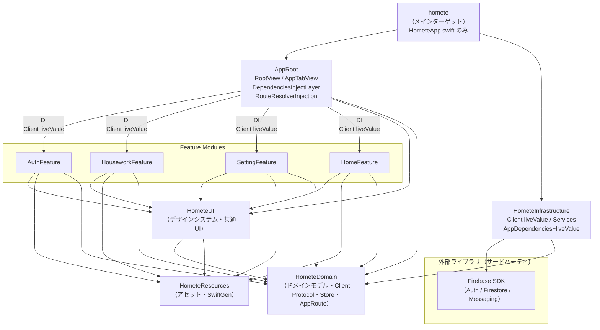

# マルチモジュール構成

> この構成を採用した背景・目的・意思決定の経緯は [ADR-0001](adr/0001-spm-multimodule-structure.md) を参照。

## モジュール構成

### 各モジュールの役割

| モジュール | 役割 | 依存先 |
|---|---|---|
| `HometeDomain` | ドメインモデル・Client プロトコル・Store・UseCase・AppRoute | なし（最下層） |
| `HometeResources` | アセット（色・画像）・SwiftGen 生成コード | なし |
| `HometeUI` | デザインシステム・共通コンポーネント・View ユーティリティ | `HometeDomain`, `HometeResources` |
| `AuthFeature` | 認証関連 View | `HometeDomain`, `HometeUI`, `HometeResources` |
| `HouseworkFeature` | 家事ボード関連 View | `HometeDomain`, `HometeUI`, `HometeResources` |
| `SettingFeature` | 設定関連 View | `HometeDomain`, `HometeUI`, `HometeResources` |
| `HomeFeature` | ホーム画面・同居人管理関連 View | `HometeDomain`, `HometeUI`, `HometeResources` |
| `HometeInfrastructure` | Client liveValue 実装・Services（Firestore / SignInWithApple）・Firebase 依存 | `HometeDomain`, Firebase SDK |
| `AppRoot` | RootView・AppTabView・DependenciesInjectLayer・RouteResolverInjection | `HometeDomain`, `HometeUI`, 全 Feature |
| `homete`（メインターゲット） | アプリエントリーポイント（`HometeApp.swift`） | `AppRoot`, `HometeInfrastructure` |

### ディレクトリ構成

```
HometeDomain/
  ├── Domain Models (Account, HouseworkItem, CohabitantData...)
  ├── Client Protocols + previewValue
  ├── Stores (AccountStore, HouseworkListStore, CohabitantStore, AccountAuthStore)
  ├── UseCase (複数Storeを合成するオーケストレーションロジック)
  └── AppRoute + RouteResolver

HometeResources/
  └── Assets（Colors.xcassets, Image.xcassets）+ SwiftGen 生成コード

HometeUI/
  ├── DesignSystem（色、フォント、共通スタイル）
  ├── 共通コンポーネント（ボタン、カード等）
  └── ViewUtilities（Alert、Navigation 等）

Features/
  ├── AuthFeature/
  ├── HouseworkFeature/
  ├── SettingFeature/
  └── HomeFeature/          ← 同居人管理 View を含む

HometeInfrastructure/
  ├── Client liveValue 実装（Impl*.swift）
  ├── Services（FirestoreService, SignInWithAppleService...）
  └── AppDependencies+liveValue

AppRoot/
  ├── RootView / AppTabView / LaunchScreenView
  ├── DependenciesInjectLayer
  └── RouteResolverInjection

homete（メインターゲット）/
  └── HometeApp.swift（アプリエントリーポイント）
```

## モジュール間の依存関係


```mermaid
graph TD
    subgraph ExternalLibs["外部ライブラリ（サードパーティ）"]
        Firebase["Firebase SDK\n（Auth / Firestore / Messaging）"]
    end

    homete["homete\n（メインターゲット）\nHometeApp.swift のみ"]

    AppRoot["AppRoot\nRootView / AppTabView\nDependenciesInjectLayer\nRouteResolverInjection"]

    HometeInfrastructure["HometeInfrastructure\nClient liveValue / Services\nAppDependencies+liveValue"]

    subgraph Features["Feature Modules"]
        AuthFeature
        HouseworkFeature
        SettingFeature
        HomeFeature
    end

    HometeUI["HometeUI\n（デザインシステム・共通 UI）"]
    HometeResources["HometeResources\n（アセット・SwiftGen）"]
    HometeDomain["HometeDomain\n（ドメインモデル・Client Protocol・Store・AppRoute）"]

    homete --> AppRoot
    homete --> HometeInfrastructure

    HometeInfrastructure --> Firebase
    HometeInfrastructure --> HometeDomain

    AppRoot -->|DI \n Client liveValue| AuthFeature
    AppRoot -->|DI \n Client liveValue| HouseworkFeature
    AppRoot -->|DI \n Client liveValue| SettingFeature
    AppRoot -->|DI \n Client liveValue| HomeFeature
    AppRoot --> HometeUI
    AppRoot --> HometeDomain

    AuthFeature --> HometeUI
    HouseworkFeature --> HometeUI
    SettingFeature --> HometeUI
    HomeFeature --> HometeUI

    AuthFeature --> HometeResources
    HouseworkFeature --> HometeResources
    SettingFeature --> HometeResources
    HomeFeature --> HometeResources

    AuthFeature --> HometeDomain
    HouseworkFeature --> HometeDomain
    SettingFeature --> HometeDomain
    HomeFeature --> HometeDomain

    HometeUI --> HometeDomain
    HometeUI --> HometeResources
```

> **ルール:**
> - 外部ライブラリへの依存は `HometeInfrastructure` のみが持つ。Feature モジュールは外部ライブラリに直接依存しない
> - `HometeInfrastructure` が Client の `liveValue` を実装し、`AppRoot` の `DependenciesInjectLayer` が Environment 経由で各 Feature に DI する
> - Feature モジュール間の直接依存は禁止。Feature 間の画面遷移は必ず RouteResolver パターンを使用する
> - Feature 内部の画面遷移は RouteResolver を使用しない。Feature 専用のルート enum を定義して管理する

## Feature 間の画面遷移（RouteResolver パターン）

Feature モジュール間で直接依存せずに画面遷移を実現するため、`HometeDomain` に `AppRoute` enum を、`HometeUI` に `RouteResolver` を定義し、メインターゲットで実態を DI する。

### 使用する場面・しない場面

| 遷移の種類 | 方法 | 例 |
|---|---|---|
| **Feature 間**（別モジュールへの遷移） | `RouteResolver` + `AppRoute` を使用 | `HomeFeature` → `SettingFeature` |
| **Feature 内**（同一モジュール内の遷移） | Feature 専用のルート enum を定義 | `HouseworkFeature` 内の詳細画面遷移 |

`AppRoute` は Feature 間遷移のみを定義する。Feature 内部の画面を `AppRoute` に追加してはいけない。Feature 内の NavigationStack の遷移管理は、各 Feature が独自のルート enum（例: `HouseworkBoardRoute`）と `AppNavigationPath<RouteType>` を使って行う。

### HometeDomain 側（Feature 間ルートのみ）

```swift
// Feature 間遷移のみを定義する
enum AppRoute: Hashable {
    case cohabitantRegistration  // HomeFeature → AuthFeature
    case setting                 // HomeFeature → SettingFeature
}
```

```swift
// HometeUI 側
struct RouteResolver: Sendable {
    private var _resolve: @MainActor @Sendable (AppRoute) -> AnyView

    public init<V: View>(@ViewBuilder resolve: @escaping @MainActor @Sendable (AppRoute) -> V) {
        _resolve = { AnyView(resolve($0)) }
    }

    @MainActor
    public func resolve(_ route: AppRoute) -> some View {
        _resolve(route)
    }
}

extension EnvironmentValues {
    @Entry var routeResolver: RouteResolver = .preview
}
```

### Feature 側（使用例）

```swift
// Feature 間遷移には RouteResolver を使用する
struct HomeView: View {
    @Environment(\.routeResolver) private var router

    var body: some View {
        // ...
        .sheet(isPresented: $isShowSetting) {
            router.resolve(.setting)  // SettingFeature への遷移
        }
        .fullScreenCover(isPresented: $isShowCohabitantRegistration) {
            router.resolve(.cohabitantRegistration)  // AuthFeature への遷移
        }
    }
}

// Feature 内遷移には Feature 専用のルート enum を使用する
enum HouseworkBoardRoute: Hashable {
    case houseworkDetail(HouseworkItem)  // HouseworkFeature 内の遷移
}

extension EnvironmentValues {
    @Entry var houseworkBoardNavigationPath = AppNavigationPath<HouseworkBoardRoute>()
}

struct HouseworkBoardView: View {
    @State var navigationPath = AppNavigationPath<HouseworkBoardRoute>()

    var body: some View {
        NavigationStack(path: $navigationPath.path) {
            // ...
            .navigationDestination(for: HouseworkBoardRoute.self) { route in
                switch route {
                case .houseworkDetail(let item):
                    HouseworkDetailView(item: item)
                }
            }
            .environment(\.houseworkBoardNavigationPath, navigationPath)
        }
    }
}
```

### メインターゲット側（解決実態）

```swift
// AppRoute の各 case に対応する View をメインターゲットで解決する
private struct RouteResolverInjectionModifier: ViewModifier {
    func body(content: Content) -> some View {
        content
            .environment(\.routeResolver, RouteResolver { route in
                switch route {
                case .cohabitantRegistration:
                    CohabitantRegistrationView()
                case .setting:
                    SettingView()
                case .houseworkApproval(let item):
                    HouseworkApprovalView(item: item)
                }
            })
    }
}
```

## Store の配置方針

Store は `HometeDomain` に配置する。理由:

- Store は特定の画面に依存しない、全画面で再利用可能なビジネスルール・ドメインモデルを提供するオブジェクト
- 複数 Feature から共有される（例: `HouseworkListStore` は `HouseworkBoardView`、`HomeView` 等で利用）
- Client Protocol に依存するが、これも `HometeDomain` 内にあるため整合性が取れる
- メインターゲットで Store を初期化し、Environment 経由で各 Feature に注入

## UseCase の配置方針

> この層を採用した背景・意思決定の経緯は [ADR-0003](adr/0003-usecase-layer.md) を参照。

複数の Store・ドメインモデル・Client を合成するオーケストレーションロジックは、`HometeDomain` の `UseCase` に配置する。

- Store は単一ドメインの状態管理という責務に留め、Store 同士が直接依存し合うことは禁止のまま
- 複数 Store を跨ぐ処理が必要な場合のみ UseCase を新設する。単一 Store で完結する処理は View から直接 Store を呼び出す
- 命名は `〇〇UseCase` とし、メソッド名は用途が分かる名前にする（`execute` のような汎用名は避ける）
- メインターゲット（または `AppRoot`）で必要な Store を組み立てて UseCase に注入し、View には UseCase を渡す

## 補足・制約事項

- **ProjectTools**（SwiftLint / Danger）は現行のローカルパッケージ形式のまま変更不要
- **Firebase iOS SDK** 等のサードパーティ依存はメインターゲット（Services 層）が保持する
- **Swift 6 strict concurrency** との整合性（actor 分離、Sendable 等）は各 Phase で確認する
- **Feature 間の循環依存**を防ぐため、Feature 間の画面遷移は必ず RouteResolver パターンを使用する
